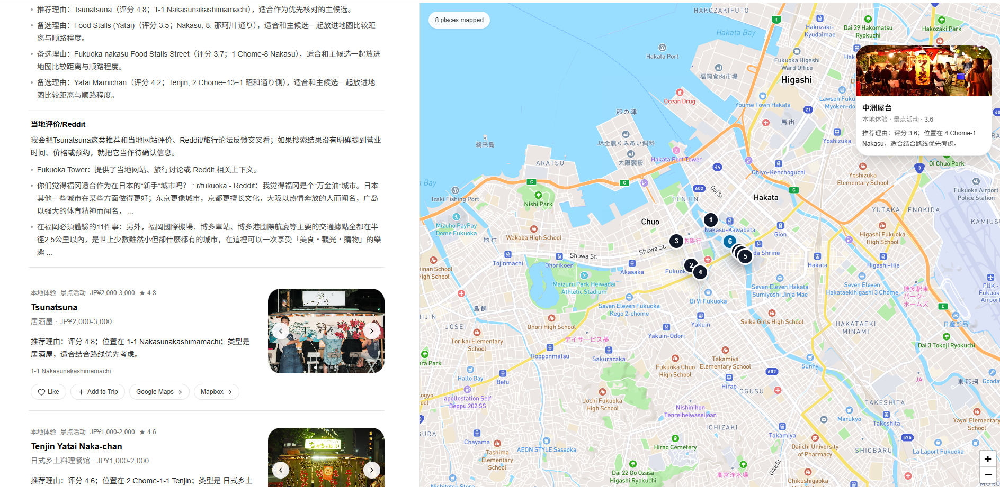
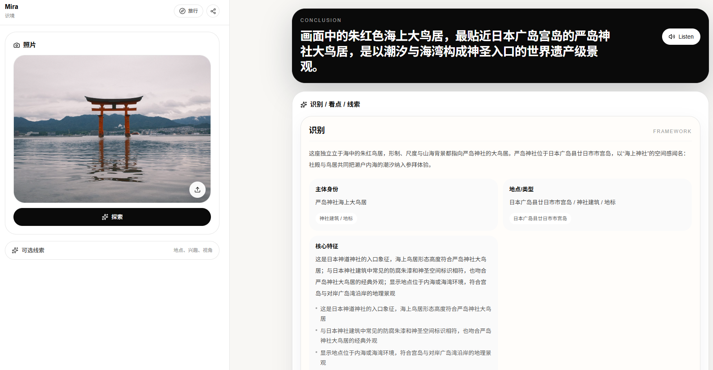
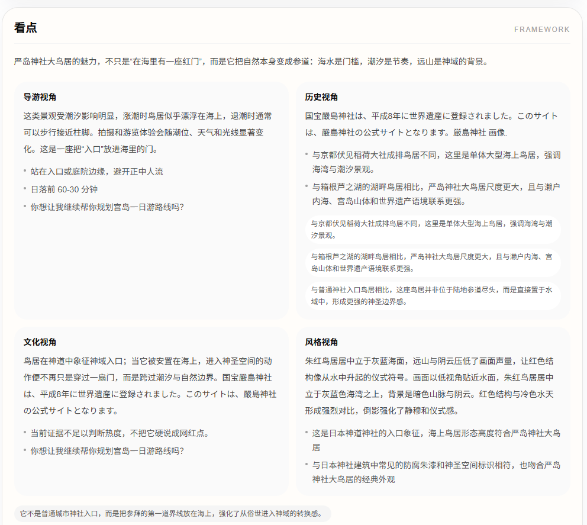
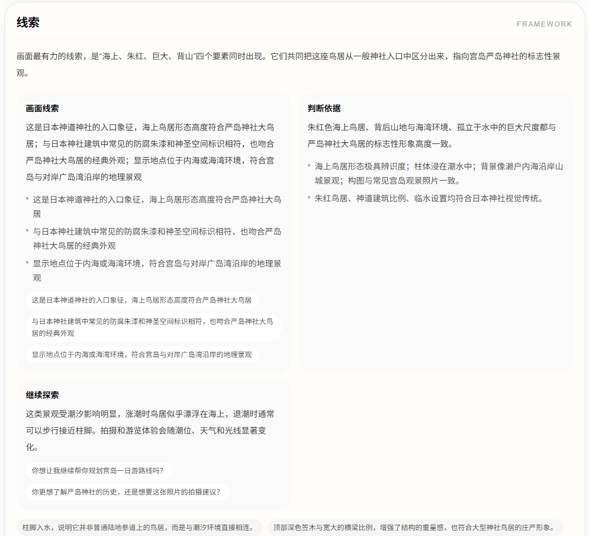
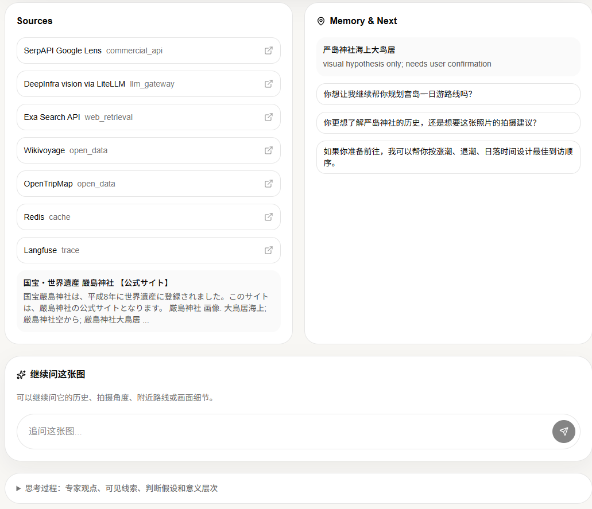
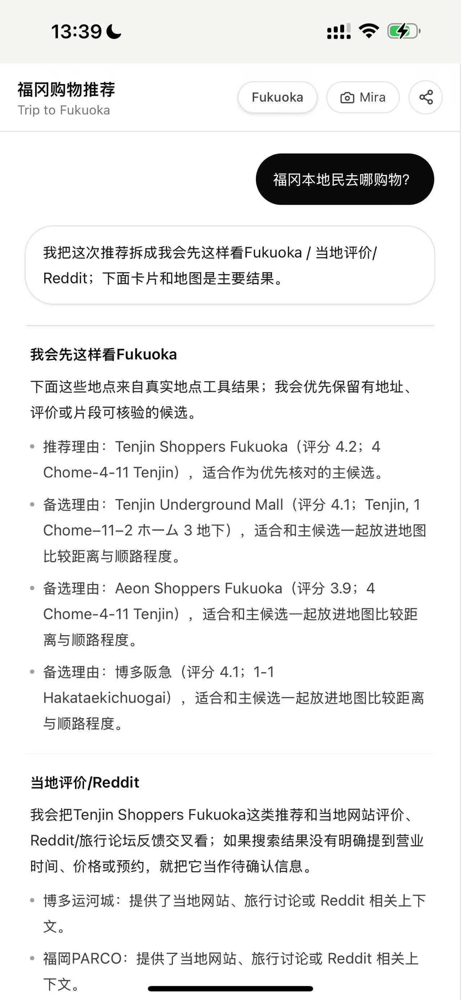
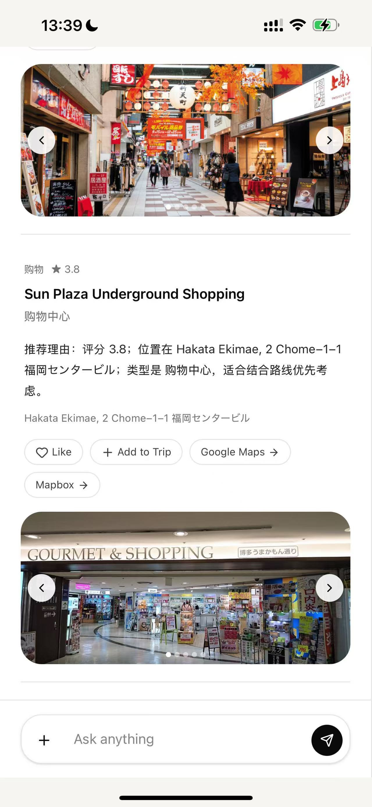

# Mira

Mira is a dual-end AI travel and visual discovery project:

- **Web app**: a Next.js experience for travel recommendations and one-photo visual discovery.
- **iOS app shell**: a Capacitor wrapper that opens the same Web product inside a native iOS container.
- **Backend**: a FastAPI service that coordinates travel planning, live search, maps, visual reasoning, and model routing.

The product is designed for a phone-first workflow: ask where to go, get grounded place cards and map pins, then switch to photo-based discovery when you want to understand what you are seeing.

## Product Gallery

Web and iOS builds are both deployed and validated. Deployment URLs are intentionally omitted from this open-source README; the screenshots below show the running dual-end experience.

### Web Travel

| Travel answer with map | Follow-up travel map |
| --- | --- |
|  |  |

### Web Visual Discovery

| Visual result | Perspectives |
| --- | --- |
|  |  |

| Visual clues | Sources and memory |
| --- | --- |
|  |  |

### iOS Shell

| Travel answer | Travel cards | Visual result |
| --- | --- | --- |
|  |  |  |

## What It Does

### Manager Report Automation

Mira also includes an open-source daily/weekly engineering report workflow. It scans local project activity, writes an evidence JSON file, and uses an OpenAI-compatible GPT token to generate manager-ready Markdown reports.


See [Daily and Weekly Manager Report Automation](docs/manager-report-automation/README.md) for setup, one-off commands, scheduled task installation, privacy notes, and a sanitized example report.

### Travel Recommendations

- Answers direct travel questions without forcing a map.
- Uses live search when a question needs real places, photos, or map pins.
- Renders structured recommendation cards, source links, and map exits.
- Keeps short session memory for follow-up questions.
- Uses background travel jobs on mobile so long recommendations can resume after page reload or screen lock.

### Visual Discovery

- Accepts one photo with optional context.
- Returns a short conclusion plus three deeper cards.
- Supports follow-up questions against the same image session.
- Can enrich historical/cultural context from official or local sources when configured.

### iOS Shell

The iOS target lives in `apps/ios-shell`.

It is a Windows-first Capacitor project: Windows can validate config and Web behavior; macOS/Xcode builds the native app. The shell adds camera/photo access, share sheet, external browser/maps exits, status bar behavior, and keyboard behavior while the Web app remains the source of truth.

## Model Channels

The current production-style configuration keeps a GPT channel and a DeepInfra channel:

- GPT channel: `gpt-5.5` for the main travel orchestrator.
- DeepSeek channel: `deepseek-ai/DeepSeek-V4-Pro` as the strongest tested DeepSeek orchestrator candidate.
- Fast DeepSeek path: `deepseek-ai/DeepSeek-V4-Flash` for lightweight calls.

The next planned backend change is explicit dual-channel routing:

- `model_channel=gpt`
- `model_channel=deepseek`

DeepSeek V4-Pro has been smoke-tested through DeepInfra and can run the existing planner path. Broad place recommendations still need response-contract validation so cards and map pins stay complete before DeepSeek becomes a user-facing default.

## Repository Layout

```text
backend/          FastAPI backend, travel orchestration, visual reasoning, tests
web/              Next.js Web app and Playwright tests
apps/ios-shell/   Capacitor iOS shell for the unified Mira app
ops/              Local runtime helpers and smoke scripts
docs/             Plans, test matrix, and screenshots
public/           Legacy static UI assets kept for reference
mobile/           Deferred Flutter/mobile experiments
```

## Local Development

### Backend

```powershell
cd backend
python -m venv .venv
.\.venv\Scripts\Activate.ps1
pip install -e ".[dev]"
Copy-Item .env.example .env
python -m uvicorn app.main:app --host 127.0.0.1 --port 8768 --reload
```

Useful environment variables:

```powershell
$env:DEEPINFRA_API_KEY='your-deepinfra-token'
$env:SERPER_API_KEY='your-serper-token'
$env:TRAVEL_MAIN_API_KEY='your-gpt-gateway-token'
$env:TRAVEL_MAIN_BASE_URL='https://your-openai-compatible-gateway/v1'
```

Run backend checks:

```powershell
cd backend
python -m pytest -q
python -m compileall app
```

### Web

```powershell
cd web
npm install
npm run dev -- -H 127.0.0.1 -p 3101
```

Run Web checks:

```powershell
cd web
npm run lint
npm run build
npm test -- --reporter=list --workers=2
```

### iOS Shell

```powershell
cd apps/ios-shell
npm install
npm test
npm run config:print
```

On macOS:

```bash
cd apps/ios-shell
npm ci
npm run config:app
npx cap add ios
npx cap sync ios
npm run ios:patch-ats
npx cap build ios
```

For production or TestFlight, prefer HTTPS for the Web origin. The current HTTP default is for internal validation only.

## Verification Snapshot

Recent local validation:

- Backend: `191 passed, 11 skipped`
- Web Playwright: `48 passed`
- Web lint/build: passed
- iOS shell tests: `4 passed`
- Deployment smoke: Web travel, Web visual, backend health, travel background jobs, and visual POST returned 200.

## Security Notes

Do not commit local `.env` files, API keys, logs, build outputs, or generated native iOS projects. The root `.gitignore` excludes those paths. Use `backend/.env.example` as the public configuration template.
