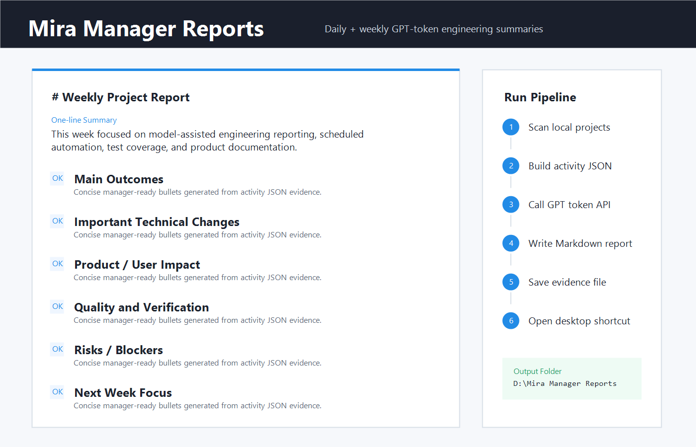

# Daily and Weekly Manager Report Automation

This repository includes a small Windows-first reporting workflow that turns local engineering activity into manager-ready Markdown reports.

It is useful when work spans several local projects and not every important change is represented by a clean commit history. The workflow can scan file modification activity, optionally include git activity through `gitglimpse`, and ask an OpenAI-compatible GPT endpoint to produce a concise daily or weekly report.



## What It Generates

Each run writes two files:

- `YYYY-MM-DD-<label>-daily.md` or `YYYY-Www-<label>-weekly.md`
- The matching `.activity.json` evidence file

By default on Windows, reports are written to:

```text
D:\Mira Manager Reports
```

If `D:\` is unavailable, the scheduled runner falls back to the user's Documents folder. You can override the location with:

```powershell
$env:MANAGER_REPORT_OUTPUT_DIR = "C:\Users\you\Documents\Manager Reports"
```

The scheduled runner also creates or updates a desktop shortcut named `Mira Manager Reports.lnk`.

## Token Setup

The report generator uses an OpenAI-compatible chat completions endpoint. It resolves the token in this order:

1. `GPT55_PRO_API_KEY`
2. `%USERPROFILE%\.codex-gpt55-token\secrets\gpt55-pro.key`

Never commit real token files. The scripts only read the token locally and do not print it.

## One-Off Daily Report

```powershell
.\ops\run-scheduled-project-report.ps1 `
  -Mode daily `
  -Root "C:\path\to\project-a","C:\path\to\project-b" `
  -Since "yesterday" `
  -ProjectRoot (Get-Location).Path
```

## One-Off Weekly Report

```powershell
.\ops\run-scheduled-project-report.ps1 `
  -Mode weekly `
  -Root "C:\path\to\project-a","C:\path\to\project-b" `
  -Since "7 days ago" `
  -ProjectRoot (Get-Location).Path
```

## Install Scheduled Tasks

Run PowerShell as Administrator, or run the installer and accept the UAC prompt:

```powershell
.\ops\install-report-scheduled-tasks.ps1 `
  -ScanRoot "C:\path\to\project-a","C:\path\to\project-b" `
  -DailyTime "18:30" `
  -WeeklyTime "18:45"
```

The installer creates:

- `Mira Project Daily Manager Report`
- `Mira Project Weekly Manager Report`

## Privacy Notes

- Keep `.env`, token files, logs, raw private reports, and generated local report folders out of git.
- Review generated Markdown before sharing it outside your machine.
- Use `-SkipGitActivity -IncludeFileActivity` when you want timestamp-based local evidence only.
- Use `-ForceFallback` only when you need a deterministic non-model report.

## Example

See the sanitized sample report:

[example-weekly-report.md](example-weekly-report.md)
